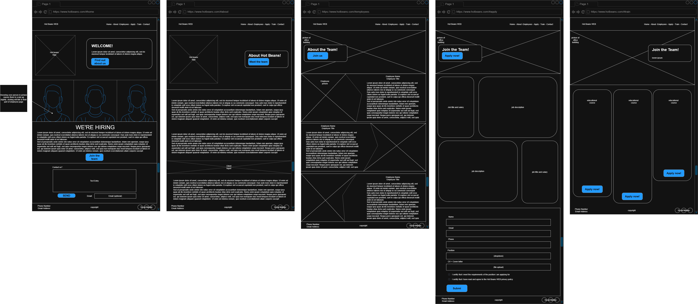

U15A2-webdev
============

## Designing and development of a website

###### BTEC L3 Y3 U15A2

###### This repository has no attached licence as it is produced as part of a qualification.

___

## Index:

1. [Context](#context)
    - [Brief](#brief)
2. [Design](#design-review)
    - [Justification](#justification)
3. [Review](#review)
    - [Optimisations](#optimisations)
    - [Testing](#testing)

___

## Context

You have recently joined a web development company, Hot Beans Web as a junior web developer. You have been asked as part
of your induction and training to create a new section for the company’s website which promotes the company to
prospective employees, as they need to recruit more web developers. The company wants you to include the following
things:

- A profile of the company itself
- profiles of existing trainee web developers
- job specifications and required qualifications
- an on-line application form
- links to web development courses

The target audience for the site is people who have completed training courses or qualifications related to web
development and are now looking for a job as a web developer.

### Brief

Create and evaluate comprehensive designs for the website which include:

- identification of user requirements
- visual designs for the pages
- alternative design options
- technical documentation

Produce a justification of the design decisions you made, explaining how it will meet the user needs and be fit for
purpose.  
Develop the website and test it for functionality, compatibility (with different devices and browsers) and usability
(including user testing), using appropriate test plans, test schedules and data.  
You should collect results and feedback and show that you have responded to any problem or errors identified.  
Optimise the website, using the results of testing and user feedback and record the details of the changes you have made
so that ‘before’ and ‘after’ versions of the website can be seen.  
Write an evaluation of the design, development and optimisation of the website. You should provide a detailed and
balanced evaluation of how effectively your completed website meets the client requirements, including appealing to the
target audience and meeting its stated purpose, in comparison to alternative solutions.  
Your evaluation should be supported by evidence from all stages of the project to reach conclusions and suggest
developments. The evaluation must contain a systematic and accurate review of your own skills, performance and
behaviours and the impact that this had on the development of the final website.  
Present evidence that you have shown individual responsibility, effective time-management in your design and development
of the website making high-quality justified recommendations and decisions. This should include a task plan for
completing the assignment and a witness testimony from your tutor. For example, you need to show how you have:

- Planned and managed your time and met targets.
- Reviewed and responded to outcomes including the use of feedback from others
- Behaved appropriately while completing the assignment – including professionalism, etiquette, supportive of others,
  timely and appropriate leadership, accountability and individual responsibility
- Evaluated outcomes to help inform high-quality justified recommendations and decisions
- Used appropriate methods of communication effectively

---

## Design-Review

This design doc has several changes from the initial rendition, reviewed by @kaoala7577 these include:

- The contact form was previously present on most pages, this has been reduced to just the index page. A nav link has
  been added to link back to it.
- The contact and application form have been reformatted to reduce fields sharing lines and improve accessibility.
- The design docs do not address mobile design, while this hasn't been rectified visually, the following decisions were
  made:
    - On the Employee page, bios will be hidden on mobile devices and can be revealed by clicking on the employee.
    - On the Application page, the cards will be re-arranged so that the descriptions are below the titles and hidden
      using the same script as employees.
    - On the Training page, the courses will be moved into a single column to reduce word splitting.

### Justification

In my design, I have considered user requirements by incorporating logos of major brands that Hot Beans have worked with
in the past. This gives potential new hires a good idea of the businesses whose site they'll be working on and
makes a positive impression through presentation of portfolio potential. I have further considered user requirements by
providing site visitors with bios for employees they'll be working with; by doing this, I ensure they have a good
understanding of the environment that they'll be working in should they choose to apply for a position.

I have also considered in my design practical usage that aims to fulfil the requirements of Hot Beans. By breaking the
site into the relevant pages, about, employees and apply — the website successfully delivers necessary information
cleanly and without jumping subjects.

The proposed design follows a linear path with a non-linear option allowing guided visitation and directing focus
without imposing upon or restricting visitors. I have put care into determining how the site will change between
different window sizes and between desktop and mobile platforms to ensure accessibility, readability and maintain
aesthetic. Major deformations will be present across each page.

- on index, pictures will disappear on smaller screens, decreasing loading times and avoiding forcing text too vertical.
- on about, the company logos will re-arrange themselves into a grid that retains even spread without compromising on
  visibility.
- on team, bios will be hidden until each employee is pressed on smaller screens. This avoids excessive scrolling.
- the same applies to apply but for positions.

---

## Review

Hot Beans Web have requested that I include within my website:

- A profile of the company
    - Present on the [About page](https://theverycooldog.github.io/U15A2-webdev/about.html).
- Profiles of existing trainee web developers
    - Present on the [Employee page](https://theverycooldog.github.io/U15A2-webdev/team.html).
- Job specifications and required qualifications, as well as an online application form
    - Present on the [Apply page](https://theverycooldog.github.io/U15A2-webdev/apply.html).
- Links to web development courses
    - Present on the [Training page](https://theverycooldog.github.io/U15A2-webdev/courses.html).

The scenario also states that the target audience of the site is people who have completed training courses or
qualifications related to web development and are now looking for employment. This condition has been met through the
site's layout and design.  
The layout I have created aims to funnel visitors through pages to get them interested in working at Hot Beans before
presenting them with applications. This is done using a series of well-placed links and buttons that intuitively guide
visitors in a linear path from Index → About → Employees → Apply and then further to Train if they don't have the
required qualifications. This is achieved whilst still providing the user with a standard Nav-bar so they do not feel
relieved of choice.
In terms of design, attempts are made to appeal to aspiring developers through the inclusion of large and prestigious
companies that Hot Beans have done work for on the about page. This informs potential hires that they will have a good
chance to build a solid portfolio working with established brands.

Some changes were made between my design document and the final website, these are for a variety of reasons including
but not limited to time constraints and preference for completion, demonstrating individual responsibility. Whilst it
would have been nice to produce a final website that is completely accurate to what I had in mind, sacrifices were made
to finish on time. Particularly noticeable is the absence of social media and contact info in the footer. This would not
have taken too long to implement but was a comparatively low priority when those links would have led nowhere due to no
socials being provided. I also didn't manage to incorporate the fun pattern on the Employee page as I underestimated the
difficulty of shaping zones that aren't square. Another problem with my website is that it is missing a map showing the
businesses' physical location; this is because I was unsure of my ability to correctly conceal my API key.

Overall, I believe that the website I have made, despite deviating slightly from my initial plans, has achieved fully
the
requirements set out for my by Hot Beans.

### Optimisations

Several optimisations were made throughout the process of site creation. Some of these are:

- In [commit 7a28d24](https://github.com/TheVeryCoolDog/U15A2-webdev/commit/7a28d2485730a4e30cd541a50dd5b7fa458baa54):
    - removed 17 lines of redundant code on all pages other than Index, using the nav bar to direct to that page for
      contact.
    - changed line 74 and 85 from div to section to maintain consistency and readability in Index
- In [commit 06dfba9](https://github.com/TheVeryCoolDog/U15A2-webdev/commit/06dfba958ad1b024f4304004e4ec98b84ffd899e):
    - removed switch statement from function HideShow(), generalising it and reducing necessary logic
    - fixed card related scaling issue on mobile in team by replacing parent related scaling with viewport scaling
- In [commit 174dc8b](https://github.com/TheVeryCoolDog/U15A2-webdev/commit/174dc8b17ce41dbc644740d2d2ec2cd3e57299d5):
    - updated banner in index from lines 57–66 to maintain consistency with about's banner

### Testing

The website has been tested for usage in Chrome and FireFox for compatibility, there are minor differences in appearance
due to differing browser code; however, functionality is identical.  
All buttons are known to work and have expected results. The same applies to hyperlinks.
On the index page, the pictures of Hot Beans employees do expand and shift on hover as intended, but do not link to the
employee page when clicked. This is because placing the overlay images inside an anchor to attach a link broke their
formatting. Fixing this was abandoned due to time constraints.
No other faults were identified during testing from myself and others.

Note: testing accurate as of
[commit 36f4ec4](https://github.com/TheVeryCoolDog/U15A2-webdev/commit/36f4ec431f785efda37b6041b389685bccabee57)

| Test |   Page   | Interaction         | Expected              |     Result     |
|:----:|:--------:|:--------------------|:----------------------|:--------------:|
|  1   |  Index   | Find out button     | Link to about         |       <-       |
|  2   |  Index   | Learn More          | Link to apply         |       <-       |
|  3   |  Index   | Click Employee      | Link to team          | Unincorporated |
|  4   |  Index   | Hover Employee      | Graphic expands       |       <-       |
|  5   |  Index   | Submit empty form   | Rejected              |    Accepted    |
|  6   |  About   | Meet team button    | Link to employees     |       <-       |
|  7   |  About   | Application form    | Link to apply#form    |       <-       |
|  8   |  About   | Courses page        | Link to train         |       <-       |
|  9   | Employee | Join us button      | Link to apply         |       <-       |
|  10  | Employee | Click employee (sm) | Expand their bio      |       <-       |
|  11  |  Apply   | Apply now button    | Link to #form         |       <-       |
|  12  |  Apply   | Click opening (sm)  | Expand job details    |       <-       |
|  13  |  Apply   | "click me"          | Link to train         |       <-       |
|  14  |  Apply   | Submit empty form   | Rejected              |       <-       |
|  15  |  Apply   | privacy policy      | Open modal            |       <-       |
|  16  | ppmodal  | I understand        | Close ppmodal         |       <-       |
|  17  | ppmodal  | I disagree          | Pivot to google       |       <-       |
|  18  |  Train   | Find out more       | Open relevant course  |       <-       |
|  19  |  Global  | Hot Beans WEB       | Link to index         |       <-       |
|  20  |  Global  | Home (nav)          | Link to index         |       <-       |
|  21  |  Global  | About (nav)         | Link to about         |       <-       |
|  22  |  Global  | Employees (nav)     | Link to team          |       <-       |
|  23  |  Global  | Apply (nav)         | Link to apply         |       <-       |
|  24  |  Global  | Train (nav)         | Link to courses       |       <-       |
|  25  |  Global  | Contact (nav)       | Link to index#contact |       <-       |
|  26  |  Global  | Footer icon         | Link to index         |       <-       |